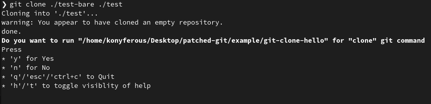

# README

Warning - read this only if you are willing to try following

```sh
# .zshrc / .bashrc
PATH_WITHOUT_PATCHING="$PATH"
ENABLE_PATCHING=1
PATCHED_GIT_PATH="$HOME/path/to/wherever/the/repo/was/cloned/patched-git/patched-bin"
if [[ $ENABLE_PATCHING &&  $ENABLE_PATCHING != 0 ]]; then
    PATH="$PATCHED_GIT_PATH:$PATH"
fi
```

considering [this script](./patched-bin/git)

## Description

Repository contains code/workaround to execute automatically custom pre-configured scripts when running `git init`, or `git clone` operations, see [`config.example.yml`](./config/config.example.yml)

This is (for obvious reasons) an experimental repository, and its content shouldn't be viewed by anyone

## Dependencies

* [`jq`](https://github.com/jqlang/jq)
* `synopsis-parser` (another personal project)
  * [CodeBerg](https://codeberg.org/koniferous22/synopsis-parser)
  * [GitHub](https://github.com/koniferous22/synopsis-parser)

## Example setup

1. Setup dependencies, ensure both `jq` and `synopsis-parser` are in `$PATH`
2. Clone this repo
3. Run `make build`

    ```sh
    # Remain in the same directory - see steps below
    make -C patched-git build
    ```

4. Adjust the example project configuration - replace placeholders in [config.example.yml](./config/config.example.yml)
    * Linux

    ```sh
    cp patched-git/config/config.example.yml patched-git/config/config.yml
    # Replace relative paths with absolute
    sed -i "s#<<PWD>>#$PWD/patched-git#g" patched-git/config/config.yml
    sed -i "s#<<OS>>#$(uname | tr '[:upper:]' '[:lower:]')#g" patched-git/config/config.yml
    ```

    * macOS `darwin` - difference in [`sed` command](https://stackoverflow.com/questions/22521207/how-to-use-sed-to-change-lines-in-place-on-a-mac-darwin)

    ```sh
    cp patched-git/config/config.example.yml patched-git/config/config.yml
    # Replace relative paths with absolute
    sed -i "" "s#<<PWD>>#$PWD/patched-git#g" patched-git/config/config.yml
    sed -i "" "s#<<OS>>#$(uname | tr '[:upper:]' '[:lower:]')#g" patched-git/config/config.yml
    ```

5. Configure a few environment variables
    * Note - try this preferably in a session, rather than adding it to `.zshrc`/`.bashrc` right away
    * Full config summary in source code - [here](./git-wrapper/config/config.go)

    ```sh
    # Path override
    PATH_WITHOUT_PATCHING="$PATH"
    PATCHED_GIT_PATH="$PWD/patched-git/patched-bin"
    PATH="$PATCHED_GIT_PATH:$PATH"
    # "git-wrapper" specific env variable
    PATCHED_GIT_IS_ENABLED=true
    PATCHED_GIT_CONFIG="$PWD/patched-git/config/config.yml"
    ```

    * For `darwin` (macOS) variables need to be exported in order to be passed into subprocess (todo - validate this)

    ```sh
    export PATH_WITHOUT_PATCHING="$PATH"
    export PATCHED_GIT_PATH="$PWD/patched-git/patched-bin"
    export PATH="$PATCHED_GIT_PATH:$PATH"
    # "git-wrapper" specific env variable
    export PATCHED_GIT_IS_ENABLED=true
    export PATCHED_GIT_CONFIG="$PWD/patched-git/config/config.yml"
    ```

6. Create a [bare](https://git-scm.com/book/en/v2/Git-on-the-Server-Getting-Git-on-a-Server) repository in same directory

    ```sh
    mkdir test-bare
    git init --bare test-bare
    ```

7. Run a testing clone operation to see if [preconfigured](./config/config.example.yml) script is invoked

    ```sh
    git clone ./test-bare ./test
    ```

8. You should see following prompt

    

9. If you press `y` you should get following output

    ```txt
    Hello from patched git-clone
    ```

## Running tests

```sh
make runtests
```
